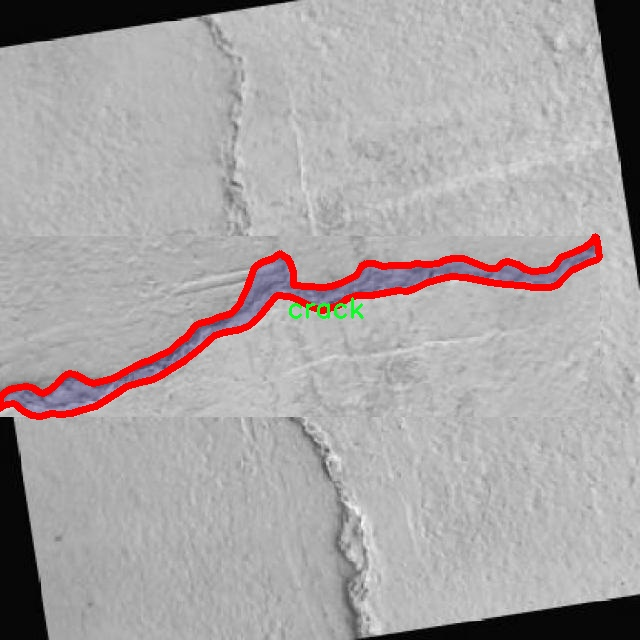

# 改进yolo11-slimneck等200+全套创新点大全：裂缝检测系统源码＆数据集全套

### 1.图片效果展示


##### 项目来源 **[人工智能促进会 2024.10.22](https://kdocs.cn/l/cszuIiCKVNis)**

##### 注意：由于项目一直在更新迭代，上面“1.图片效果展示”和“2.视频效果展示”展示的系统图片或者视频可能为老版本，新版本在老版本的基础上升级如下：（实际效果以升级的新版本为准）

  （1）适配了YOLOV11的“目标检测”模型和“实例分割”模型，通过加载相应的权重（.pt）文件即可自适应加载模型。

  （2）支持“图片识别”、“视频识别”、“摄像头实时识别”三种识别模式。

  （3）支持“图片识别”、“视频识别”、“摄像头实时识别”三种识别结果保存导出，解决手动导出（容易卡顿出现爆内存）存在的问题，识别完自动保存结果并导出到tempDir中。

  （4）支持Web前端系统中的标题、背景图等自定义修改。

  另外本项目提供训练的数据集和训练教程,暂不提供权重文件（best.pt）,需要您按照教程进行训练后实现图片演示和Web前端界面演示的效果。

### 2.视频效果展示

[2.1 视频效果展示](https://www.bilibili.com/video/BV1LmyRYvEvy/)

### 3.背景

研究背景与意义

随着城市化进程的加快，基础设施的老化和损坏问题日益突出，尤其是道路、桥梁和建筑物等结构物的裂缝问题，直接影响到人们的生活安全和财产安全。因此，及时、准确地检测和评估这些裂缝的情况，成为了现代工程管理中的一项重要任务。传统的裂缝检测方法主要依赖人工检查，效率低下且容易受到主观因素的影响，难以满足大规模基础设施监测的需求。近年来，随着计算机视觉和深度学习技术的迅猛发展，基于图像处理的自动化裂缝检测系统逐渐成为研究热点。

本研究旨在基于改进的YOLOv11模型，构建一个高效的裂缝检测系统。YOLO（You Only Look Once）系列模型以其快速的检测速度和较高的准确率，广泛应用于目标检测领域。通过对YOLOv11进行改进，结合实例分割技术，可以实现对裂缝的精确定位和分割，从而提高检测的准确性和可靠性。为此，本研究将使用包含4000张图像的apex-crackAi数据集，该数据集专注于裂缝这一单一类别，具有较高的代表性和实用性。

通过对该数据集的深入分析和模型训练，期望能够提升裂缝检测的自动化水平，减少人工干预，提高检测效率。同时，研究成果不仅可以为基础设施的维护和管理提供技术支持，还能为相关领域的研究提供新的思路和方法，推动智能监测技术的发展。因此，本研究具有重要的理论价值和实际应用意义。

### 4.数据集信息展示

##### 4.1 本项目数据集详细数据（类别数＆类别名）

nc: 1
names: ['crack']


该项目为【图像分割】数据集，请在【训练教程和Web端加载模型教程（第三步）】这一步的时候按照【图像分割】部分的教程来训练

##### 4.2 本项目数据集信息介绍

本项目数据集信息介绍

本项目所使用的数据集名为“apex-crackAi”，专门为改进YOLOv11的裂缝检测系统而设计。该数据集的核心目标是为机器学习模型提供高质量的训练样本，以便有效识别和检测结构表面上的裂缝。数据集中包含的类别数量为1，具体类别为“crack”，这意味着所有的标注样本均围绕裂缝这一特定类型展开。这种单一类别的设置使得模型在学习过程中能够集中精力于裂缝的特征提取，从而提高检测的准确性和效率。

“apex-crackAi”数据集由多种不同环境下的裂缝图像组成，涵盖了不同的光照条件、角度和背景，以确保模型在实际应用中具有良好的泛化能力。每张图像都经过精细的标注，确保裂缝的边界清晰可见，并且标注的准确性得到了严格的验证。这些图像不仅包括微小的裂缝，还涵盖了较大、明显的裂缝，以帮助模型学习不同规模裂缝的特征。

此外，数据集的构建考虑到了现实世界中裂缝出现的多样性，涵盖了混凝土、砖石等多种材料的裂缝图像。这种多样性使得训练后的YOLOv11模型能够在不同材料和环境条件下进行有效的裂缝检测，从而提升其在工程监测、基础设施维护等领域的应用潜力。通过使用“apex-crackAi”数据集，我们期望能够显著提高裂缝检测的准确性和效率，为相关领域的研究和实践提供有力支持。





### 5.全套项目环境部署视频教程（零基础手把手教学）

[5.1 所需软件PyCharm和Anaconda安装教程（第一步）](https://www.bilibili.com/video/BV1BoC1YCEKi/?spm_id_from=333.999.0.0&vd_source=bc9aec86d164b67a7004b996143742dc)


[5.2 安装Python虚拟环境创建和依赖库安装视频教程（第二步）](https://www.bilibili.com/video/BV1ZoC1YCEBw?spm_id_from=333.788.videopod.sections&vd_source=bc9aec86d164b67a7004b996143742dc)

### 6.改进YOLOv11训练教程和Web_UI前端加载模型教程（零基础手把手教学）

[6.1 改进YOLOv11训练教程和Web_UI前端加载模型教程（第三步）](https://www.bilibili.com/video/BV1BoC1YCEhR?spm_id_from=333.788.videopod.sections&vd_source=bc9aec86d164b67a7004b996143742dc)


按照上面的训练视频教程链接加载项目提供的数据集，运行train.py即可开始训练



     Epoch   gpu_mem       box       obj       cls    labels  img_size
     1/200     20.8G   0.01576   0.01955  0.007536        22      1280: 100%|██████████| 849/849 [14:42<00:00,  1.04s/it]
               Class     Images     Labels          P          R     mAP@.5 mAP@.5:.95: 100%|██████████| 213/213 [01:14<00:00,  2.87it/s]
                 all       3395      17314      0.994      0.957      0.0957      0.0843

     Epoch   gpu_mem       box       obj       cls    labels  img_size
     2/200     20.8G   0.01578   0.01923  0.007006        22      1280: 100%|██████████| 849/849 [14:44<00:00,  1.04s/it]
               Class     Images     Labels          P          R     mAP@.5 mAP@.5:.95: 100%|██████████| 213/213 [01:12<00:00,  2.95it/s]
                 all       3395      17314      0.996      0.956      0.0957      0.0845

     Epoch   gpu_mem       box       obj       cls    labels  img_size
     3/200     20.8G   0.01561    0.0191  0.006895        27      1280: 100%|██████████| 849/849 [10:56<00:00,  1.29it/s]
               Class     Images     Labels          P          R     mAP@.5 mAP@.5:.95: 100%|███████   | 187/213 [00:52<00:00,  4.04it/s]
                 all       3395      17314      0.996      0.957      0.0957      0.0845


###### [项目数据集下载链接](https://kdocs.cn/l/cszuIiCKVNis)

### 7.原始YOLOv11算法讲解


##### YOLOv11三大损失函数

YOLOv11（You Only Look Once）是一种流行的目标检测算法，其损失函数设计用于同时优化分类和定位任务。YOLO的损失函数通常包括几个部分：
**分类损失、定位损失（边界框回归损失）和置信度损失** 。其中，

  1. box_loss（边界框回归损失）是用于优化预测边界框与真实边界框之间的差异的部分。

  2. cls_loss（分类损失）是用于优化模型对目标类别的预测准确性的部分。分类损失确保模型能够正确地识别出图像中的对象属于哪个类别。

  3. dfl_loss（Distribution Focal Loss）是YOLO系列中的一种损失函数，特别是在一些改进版本如YOLOv5和YOLOv7中被引入。它的主要目的是解决目标检测中的类别不平衡问题，并提高模型在处理小目标和困难样本时的性能。

##### 边界框回归损失详解

box_loss（边界框回归损失）是用于优化预测边界框与真实边界框之间的差异的部分。


##### box_loss 的具体意义


##### 为什么需要 box_loss

  * 精确定位：通过最小化中心点坐标损失和宽高损失，模型能够更准确地预测目标的位置和大小。
  * 平衡不同类型的目标：使用平方根来处理宽高损失，可以更好地平衡不同大小的目标，确保小目标也能得到足够的关注。
  * 稳定训练：适当的损失函数设计有助于模型的稳定训练，避免梯度爆炸或消失等问题。

##### 分类损失详解

在YOLO（You Only Look
Once）目标检测算法中，cls_loss（分类损失）是用于优化模型对目标类别的预测准确性的部分。分类损失确保模型能够正确地识别出图像中的对象属于哪个类别。下面是关于cls_loss的详细解读：

##### 分类损失 (cls_loss) 的具体意义

  
分类损失通常使用交叉熵损失（Cross-Entropy
Loss）来计算。交叉熵损失衡量的是模型预测的概率分布与真实标签之间的差异。在YOLO中，分类损失的具体形式如下：


##### 为什么需要 cls_loss

  * 类别识别：cls_loss 确保模型能够正确识别出图像中的目标属于哪个类别。这对于目标检测任务至关重要，因为不仅需要知道目标的位置，还需要知道目标的类型。

  * 多类别支持：通过最小化分类损失，模型可以处理多个类别的目标检测任务。例如，在道路缺陷检测中，可能需要识别裂缝、坑洞、路面破损等多种类型的缺陷。

  * 提高准确性：分类损失有助于提高模型的分类准确性，从而提升整体检测性能。通过优化分类损失，模型可以更好地学习不同类别之间的特征差异。

##### 分布损失详解

`dfl_loss`（Distribution Focal
Loss）是YOLO系列中的一种损失函数，特别是在一些改进版本如YOLOv5和YOLOv7中被引入。它的主要目的是解决目标检测中的类别不平衡问题，并提高模型在处理小目标和困难样本时的性能。下面是对`dfl_loss`的详细解读：

##### DFL Loss 的背景

在目标检测任务中，类别不平衡是一个常见的问题。某些类别的样本数量可能远远多于其他类别，这会导致模型在训练过程中对常见类别的学习效果较好，而对罕见类别的学习效果较差。此外，小目标和困难样本的检测也是一个挑战，因为这些目标通常具有较少的特征信息，容易被忽略或误分类。

为了应对这些问题，研究者们提出了多种改进方法，其中之一就是`dfl_loss`。`dfl_loss`通过引入分布焦点损失来增强模型对困难样本的关注，并改善类别不平衡问题。

##### DFL Loss 的定义

DFL Loss
通常与传统的交叉熵损失结合使用，以增强模型对困难样本的学习能力。其核心思想是通过对每个类别的预测概率进行加权，使得模型更加关注那些难以正确分类的样本。

DFL Loss 的公式可以表示为：


##### DFL Loss 的具体意义**

  * **类别不平衡：** 通过引入平衡因子 α，DFL Loss 可以更好地处理类别不平衡问题。对于少数类别的样本，可以通过增加其权重来提升其重要性，从而提高模型对这些类别的检测性能。
  *  **困难样本：** 通过聚焦参数 γ，DFL Loss 可以让模型更加关注那些难以正确分类的样本。当 
  * γ 较大时，模型会对那些预测概率较低的样本给予更多的关注，从而提高这些样本的分类准确性。
  *  **提高整体性能** ：DFL Loss 结合了传统交叉熵损失的优势，并通过加权机制增强了模型对困难样本的学习能力，从而提高了整体的检测性能。


### 8.200+种全套改进YOLOV11创新点原理讲解

#### 8.1 200+种全套改进YOLOV11创新点原理讲解大全

由于篇幅限制，每个创新点的具体原理讲解就不全部展开，具体见下列网址中的改进模块对应项目的技术原理博客网址【Blog】（创新点均为模块化搭建，原理适配YOLOv5~YOLOv11等各种版本）

[改进模块技术原理博客【Blog】网址链接](https://gitee.com/qunmasj/good)


#### 8.2 精选部分改进YOLOV11创新点原理讲解

###### 这里节选部分改进创新点展开原理讲解(完整的改进原理见上图和[改进模块技术原理博客链接](https://gitee.com/qunmasj/good)【如果此小节的图加载失败可以通过CSDN或者Github搜索该博客的标题访问原始博客，原始博客图片显示正常】

### RCS-OSA的基本原理
参考该博客，RCSOSA（RCS-One-Shot Aggregation）是RCS-YOLO中提出的一种结构，我们可以将主要原理概括如下：

1. RCS（Reparameterized Convolution based on channel Shuffle）: 结合了通道混洗，通过重参数化卷积来增强网络的特征提取能力。

2. RCS模块: 在训练阶段，利用多分支结构学习丰富的特征表示；在推理阶段，通过结构化重参数化简化为单一分支，减少内存消耗。

3. OSA（One-Shot Aggregation）: 一次性聚合多个特征级联，减少网络计算负担，提高计算效率。

4. 特征级联: RCS-OSA模块通过堆叠RCS，确保特征的复用并加强不同层之间的信息流动。

#### RCS
RCS（基于通道Shuffle的重参数化卷积）是RCS-YOLO的核心组成部分，旨在训练阶段通过多分支结构学习丰富的特征信息，并在推理阶段通过简化为单分支结构来减少内存消耗，实现快速推理。此外，RCS利用通道分割和通道Shuffle操作来降低计算复杂性，同时保持通道间的信息交换，这样在推理阶段相比普通的3×3卷积可以减少一半的计算复杂度。通过结构重参数化，RCS能够在训练阶段从输入特征中学习深层表示，并在推理阶段实现快速推理，同时减少内存消耗。

#### RCS模块
RCS（基于通道Shuffle的重参数化卷积）模块中，结构在训练阶段使用多个分支，包括1x1和3x3的卷积，以及一个直接的连接（Identity），用于学习丰富的特征表示。在推理阶段，结构被重参数化成一个单一的3x3卷积，以减少计算复杂性和内存消耗，同时保持训练阶段学到的特征表达能力。这与RCS的设计理念紧密相连，即在不牺牲性能的情况下提高计算效率。


上图为大家展示了RCS的结构，分为训练阶段（a部分）和推理阶段（b部分）。在训练阶段，输入通过通道分割，一部分输入经过RepVGG块，另一部分保持不变。然后通过1x1卷积和3x3卷积处理RepVGG块的输出，与另一部分输入进行通道Shuffle和连接。在推理阶段，原来的多分支结构被简化为一个单一的3x3 RepConv块。这种设计允许在训练时学习复杂特征，在推理时减少计算复杂度。黑色边框的矩形代表特定的模块操作，渐变色的矩形代表张量的特定特征，矩形的宽度代表张量的通道数。 

#### OSA
OSA（One-Shot Aggregation）是一个关键的模块，旨在提高网络在处理密集连接时的效率。OSA模块通过表示具有多个感受野的多样化特征，并在最后的特征映射中仅聚合一次所有特征，从而克服了DenseNet中密集连接的低效率问题。

OSA模块的使用有两个主要目的：

1. 提高特征表示的多样性：OSA通过聚合具有不同感受野的特征来增加网络对于不同尺度的敏感性，这有助于提升模型对不同大小目标的检测能力。

2. 提高效率：通过在网络的最后一部分只进行一次特征聚合，OSA减少了重复的特征计算和存储需求，从而提高了网络的计算和能源效率。

在RCS-YOLO中，OSA模块被进一步与RCS（基于通道Shuffle的重参数化卷积）相结合，形成RCS-OSA模块。这种结合不仅保持了低成本的内存消耗，而且还实现了语义信息的有效提取，对于构建轻量级和大规模的对象检测器尤为重要。

下面我将为大家展示RCS-OSA（One-Shot Aggregation of RCS）的结构。


在RCS-OSA模块中，输入被分为两部分，一部分直接通过，另一部分通过堆叠的RCS模块进行处理。处理后的特征和直接通过的特征在通道混洗（Channel Shuffle）后合并。这种结构设计用于增强模型的特征提取和利用效率，是RCS-YOLO架构中的一个关键组成部分旨在通过一次性聚合来提高模型处理特征的能力，同时保持计算效率。

#### 特征级联
特征级联（feature cascade）是一种技术，通过在网络的一次性聚合（one-shot aggregate）路径上维持有限数量的特征级联来实现的。在RCS-YOLO中，特别是在RCS-OSA（RCS-Based One-Shot Aggregation）模块中，只保留了三个特征级联。

特征级联的目的是为了减轻网络计算负担并降低内存占用。这种方法可以有效地聚合不同层次的特征，提高模型的语义信息提取能力，同时避免了过度复杂化网络结构所带来的低效率和高资源消耗。

下面为大家提供的图像展示的是RCS-YOLO的整体架构，其中包括RCS-OSA模块。RCS-OSA在模型中用于堆叠RCS模块，以确保特征的复用并加强不同层之间的信息流动。图中显示的多层RCS-OSA模块的排列和组合反映了它们如何一起工作以优化特征传递和提高检测性能。


总结：RCS-YOLO主要由RCS-OSA（蓝色模块）和RepVGG（橙色模块）构成。这里的n代表堆叠RCS模块的数量。n_cls代表检测到的对象中的类别数量。图中的IDetect是从YOLOv11中借鉴过来的，表示使用二维卷积神经网络的检测层。这个架构通过堆叠的RCS模块和RepVGG模块，以及两种类型的检测层，实现了对象检测的任务。 


### 9.系统功能展示

图9.1.系统支持检测结果表格显示

  图9.2.系统支持置信度和IOU阈值手动调节

  图9.3.系统支持自定义加载权重文件best.pt(需要你通过步骤5中训练获得)

  图9.4.系统支持摄像头实时识别

  图9.5.系统支持图片识别

  图9.6.系统支持视频识别

  图9.7.系统支持识别结果文件自动保存

  图9.8.系统支持Excel导出检测结果数据


### 10. YOLOv11核心改进源码讲解

#### 10.1 lsknet.py

以下是经过简化和注释的核心代码部分，保留了主要的结构和功能：

```python
import torch
import torch.nn as nn
from functools import partial

class Mlp(nn.Module):
    """多层感知机（MLP）模块，包含卷积层和激活函数"""
    def __init__(self, in_features, hidden_features=None, out_features=None, act_layer=nn.GELU, drop=0.):
        super().__init__()
        out_features = out_features or in_features  # 输出特征数
        hidden_features = hidden_features or in_features  # 隐藏层特征数
        self.fc1 = nn.Conv2d(in_features, hidden_features, 1)  # 第一个卷积层
        self.dwconv = DWConv(hidden_features)  # 深度卷积层
        self.act = act_layer()  # 激活函数
        self.fc2 = nn.Conv2d(hidden_features, out_features, 1)  # 第二个卷积层
        self.drop = nn.Dropout(drop)  # Dropout层

    def forward(self, x):
        """前向传播"""
        x = self.fc1(x)
        x = self.dwconv(x)
        x = self.act(x)
        x = self.drop(x)
        x = self.fc2(x)
        x = self.drop(x)
        return x


class LSKblock(nn.Module):
    """LSK块，包含多个卷积层和注意力机制"""
    def __init__(self, dim):
        super().__init__()
        self.conv0 = nn.Conv2d(dim, dim, 5, padding=2, groups=dim)  # 深度卷积
        self.conv_spatial = nn.Conv2d(dim, dim, 7, stride=1, padding=9, groups=dim, dilation=3)  # 空间卷积
        self.conv1 = nn.Conv2d(dim, dim//2, 1)  # 1x1卷积
        self.conv2 = nn.Conv2d(dim, dim//2, 1)  # 1x1卷积
        self.conv_squeeze = nn.Conv2d(2, 2, 7, padding=3)  # 压缩卷积
        self.conv = nn.Conv2d(dim//2, dim, 1)  # 1x1卷积

    def forward(self, x):   
        attn1 = self.conv0(x)  # 第一个注意力特征
        attn2 = self.conv_spatial(attn1)  # 第二个注意力特征

        attn1 = self.conv1(attn1)  # 处理第一个特征
        attn2 = self.conv2(attn2)  # 处理第二个特征
        
        attn = torch.cat([attn1, attn2], dim=1)  # 拼接特征
        avg_attn = torch.mean(attn, dim=1, keepdim=True)  # 平均池化
        max_attn, _ = torch.max(attn, dim=1, keepdim=True)  # 最大池化
        agg = torch.cat([avg_attn, max_attn], dim=1)  # 拼接池化结果
        sig = self.conv_squeeze(agg).sigmoid()  # Sigmoid激活
        attn = attn1 * sig[:,0,:,:].unsqueeze(1) + attn2 * sig[:,1,:,:].unsqueeze(1)  # 加权特征
        attn = self.conv(attn)  # 最终卷积
        return x * attn  # 返回加权后的输入


class Attention(nn.Module):
    """注意力模块"""
    def __init__(self, d_model):
        super().__init__()
        self.proj_1 = nn.Conv2d(d_model, d_model, 1)  # 投影层
        self.activation = nn.GELU()  # 激活函数
        self.spatial_gating_unit = LSKblock(d_model)  # LSK块
        self.proj_2 = nn.Conv2d(d_model, d_model, 1)  # 反投影层

    def forward(self, x):
        """前向传播"""
        shortcut = x.clone()  # 保留输入
        x = self.proj_1(x)  # 投影
        x = self.activation(x)  # 激活
        x = self.spatial_gating_unit(x)  # 空间门控
        x = self.proj_2(x)  # 反投影
        x = x + shortcut  # 残差连接
        return x


class Block(nn.Module):
    """基本块，包含注意力和MLP"""
    def __init__(self, dim, mlp_ratio=4., drop=0., drop_path=0., act_layer=nn.GELU):
        super().__init__()
        self.norm1 = nn.BatchNorm2d(dim)  # 归一化层
        self.norm2 = nn.BatchNorm2d(dim)  # 归一化层
        self.attn = Attention(dim)  # 注意力模块
        self.mlp = Mlp(in_features=dim, hidden_features=int(dim * mlp_ratio), act_layer=act_layer, drop=drop)  # MLP模块

    def forward(self, x):
        """前向传播"""
        x = x + self.attn(self.norm1(x))  # 注意力模块
        x = x + self.mlp(self.norm2(x))  # MLP模块
        return x


class OverlapPatchEmbed(nn.Module):
    """图像到补丁嵌入"""
    def __init__(self, img_size=224, patch_size=7, stride=4, in_chans=3, embed_dim=768):
        super().__init__()
        self.proj = nn.Conv2d(in_chans, embed_dim, kernel_size=patch_size, stride=stride, padding=(patch_size // 2))  # 卷积嵌入
        self.norm = nn.BatchNorm2d(embed_dim)  # 归一化层

    def forward(self, x):
        """前向传播"""
        x = self.proj(x)  # 嵌入
        x = self.norm(x)  # 归一化
        return x


class LSKNet(nn.Module):
    """LSK网络结构"""
    def __init__(self, img_size=224, in_chans=3, embed_dims=[64, 128, 256, 512], depths=[3, 4, 6, 3]):
        super().__init__()
        self.num_stages = len(depths)  # 网络阶段数

        for i in range(self.num_stages):
            patch_embed = OverlapPatchEmbed(img_size=img_size // (2 ** i), in_chans=in_chans if i == 0 else embed_dims[i - 1], embed_dim=embed_dims[i])
            block = nn.ModuleList([Block(dim=embed_dims[i]) for _ in range(depths[i])])  # 堆叠块
            norm = nn.BatchNorm2d(embed_dims[i])  # 归一化层

            setattr(self, f"patch_embed{i + 1}", patch_embed)  # 动态设置属性
            setattr(self, f"block{i + 1}", block)  # 动态设置属性
            setattr(self, f"norm{i + 1}", norm)  # 动态设置属性

    def forward(self, x):
        """前向传播"""
        outs = []
        for i in range(self.num_stages):
            patch_embed = getattr(self, f"patch_embed{i + 1}")
            block = getattr(self, f"block{i + 1}")
            norm = getattr(self, f"norm{i + 1}")
            x = patch_embed(x)  # 嵌入
            for blk in block:
                x = blk(x)  # 块处理
            x = norm(x)  # 归一化
            outs.append(x)  # 保存输出
        return outs


class DWConv(nn.Module):
    """深度卷积模块"""
    def __init__(self, dim=768):
        super(DWConv, self).__init__()
        self.dwconv = nn.Conv2d(dim, dim, 3, padding=1, groups=dim)  # 深度卷积

    def forward(self, x):
        """前向传播"""
        return self.dwconv(x)  # 深度卷积


def lsknet_t(weights=''):
    """创建LSKNet_t模型"""
    model = LSKNet(embed_dims=[32, 64, 160, 256], depths=[3, 3, 5, 2])
    if weights:
        model.load_state_dict(torch.load(weights)['state_dict'])  # 加载权重
    return model

if __name__ == '__main__':
    model = lsknet_t('lsk_t_backbone-2ef8a593.pth')  # 实例化模型
    inputs = torch.randn((1, 3, 640, 640))  # 随机输入
    for i in model(inputs):
        print(i.size())  # 输出每个阶段的特征图大小
```

### 代码核心部分说明：
1. **Mlp类**：实现了一个多层感知机，包括卷积层、深度卷积、激活函数和Dropout。
2. **LSKblock类**：实现了一个包含多个卷积和注意力机制的模块。
3. **Attention类**：实现了一个注意力机制模块，包含投影和残差连接。
4. **Block类**：实现了一个基本块，包含注意力和MLP模块。
5. **OverlapPatchEmbed类**：将输入图像嵌入到补丁中，使用卷积和归一化。
6. **LSKNet类**：整体网络结构，包含多个阶段，每个阶段由嵌入、块和归一化组成。
7. **DWConv类**：实现了深度卷积，用于特征提取。
8. **lsknet_t函数**：用于创建和加载LSKNet_t模型。

以上代码提供了一个基于卷积和注意力机制的神经网络架构，适用于图像处理任务。

这个文件定义了一个名为 `lsknet.py` 的深度学习模型，主要用于图像处理任务。模型的结构和组件设计灵活，能够处理不同大小的输入图像，并通过多层网络结构提取特征。以下是对文件中各个部分的详细说明。

首先，文件导入了必要的库，包括 PyTorch 及其神经网络模块，部分实用工具函数，以及 NumPy。接着，定义了一个名为 `Mlp` 的类，它是一个多层感知机，包含两个卷积层和一个深度卷积层，使用 GELU 激活函数和 Dropout 进行正则化。`Mlp` 类的 `forward` 方法实现了前向传播过程。

接下来是 `LSKblock` 类，这是一个特殊的块结构，包含多个卷积层和注意力机制。它通过深度可分离卷积和空间卷积来提取特征，并使用 Sigmoid 函数生成注意力权重，从而对输入进行加权。`Attention` 类则实现了一个注意力机制，结合了前面的 `LSKblock`，通过残差连接增强了信息流动。

`Block` 类是模型的基本构建块，结合了归一化、注意力机制和多层感知机。它使用 Batch Normalization 和 DropPath 技术来提高模型的稳定性和性能。

`OverlapPatchEmbed` 类用于将输入图像转换为嵌入特征，通过卷积操作生成不同大小的图像块，便于后续处理。

`LSKNet` 类是整个模型的核心，包含多个阶段的结构，每个阶段由图像块嵌入、多个 `Block` 和归一化层组成。模型的深度和宽度可以通过参数进行调整，以适应不同的任务需求。

`DWConv` 类实现了深度卷积，用于在 `Mlp` 中处理特征图。文件还定义了一个 `update_weight` 函数，用于更新模型权重，确保加载的权重与模型结构相匹配。

最后，文件提供了两个函数 `lsknet_t` 和 `lsknet_s`，分别用于创建不同配置的 LSKNet 模型，并支持加载预训练权重。在 `__main__` 部分，示例代码展示了如何实例化模型并对随机输入进行前向传播，输出每一层的特征图大小。

整体而言，这个文件实现了一个灵活且强大的图像处理模型，适用于多种计算机视觉任务。

#### 10.2 mamba_vss.py

以下是代码中最核心的部分，并附上详细的中文注释：

```python
import torch
import torch.nn as nn
import torch.nn.functional as F

class SS2D(nn.Module):
    def __init__(self, d_model, d_state=16, d_conv=3, expand=2, dropout=0., bias=False, device=None, dtype=None):
        super().__init__()
        # 初始化模型参数
        self.d_model = d_model  # 输入特征维度
        self.d_state = d_state  # 状态维度
        self.d_conv = d_conv  # 卷积核大小
        self.expand = expand  # 扩展因子
        self.d_inner = int(self.expand * self.d_model)  # 内部特征维度
        factory_kwargs = {"device": device, "dtype": dtype}

        # 输入投影层，将输入特征映射到内部特征空间
        self.in_proj = nn.Linear(self.d_model, self.d_inner * 2, bias=bias, **factory_kwargs)
        
        # 卷积层，进行特征提取
        self.conv2d = nn.Conv2d(
            in_channels=self.d_inner,
            out_channels=self.d_inner,
            groups=self.d_inner,
            bias=True,
            kernel_size=d_conv,
            padding=(d_conv - 1) // 2,
            **factory_kwargs,
        )
        
        self.act = nn.SiLU()  # 激活函数

        # 输出层的归一化和线性投影
        self.out_norm = nn.LayerNorm(self.d_inner)
        self.out_proj = nn.Linear(self.d_inner, self.d_model, bias=bias, **factory_kwargs)
        self.dropout = nn.Dropout(dropout) if dropout > 0. else None  # dropout层

    def forward(self, x: torch.Tensor):
        # 前向传播
        B, H, W, C = x.shape  # 获取输入的批次大小、高度、宽度和通道数

        # 输入投影
        xz = self.in_proj(x)  # (B, H, W, d_inner * 2)
        x, z = xz.chunk(2, dim=-1)  # 将投影结果分为x和z

        # 转换维度以适应卷积层
        x = x.permute(0, 3, 1, 2).contiguous()  # (B, d_inner, H, W)
        x = self.act(self.conv2d(x))  # 经过卷积和激活函数

        # 进行核心计算
        y = self.forward_core(x)  # 核心计算
        y = y * F.silu(z)  # 结合z进行输出
        out = self.out_proj(y)  # 最终输出投影

        if self.dropout is not None:
            out = self.dropout(out)  # 应用dropout

        return out  # 返回输出

    def forward_core(self, x: torch.Tensor):
        # 核心计算方法，具体实现略去
        pass  # 这里可以填入具体的核心计算逻辑

class VSSBlock(nn.Module):
    def __init__(self, hidden_dim: int = 0, drop_path: float = 0.2, d_state: int = 16):
        super().__init__()
        self.ln_1 = nn.LayerNorm(hidden_dim)  # 归一化层
        self.self_attention = SS2D(d_model=hidden_dim, d_state=d_state)  # 自注意力层
        self.drop_path = nn.Dropout(drop_path)  # DropPath层

    def forward(self, input: torch.Tensor):
        # 前向传播
        input = input.permute((0, 2, 3, 1))  # 调整输入维度
        x = input + self.drop_path(self.self_attention(self.ln_1(input)))  # 进行自注意力计算并加上残差连接
        return x.permute((0, 3, 1, 2))  # 恢复维度

# 这里可以继续添加其他类的实现，例如 Mamba2Block
```

### 代码核心部分说明：
1. **SS2D 类**：实现了一个带有卷积和自注意力机制的模块，主要用于特征提取和变换。
   - `__init__` 方法中定义了输入投影、卷积层、激活函数和输出层。
   - `forward` 方法实现了前向传播的逻辑，包括输入的投影、卷积和最终的输出。

2. **VSSBlock 类**：继承自 `nn.Module`，用于构建一个包含自注意力机制的块。
   - 通过 `self_attention` 调用 `SS2D` 类来实现自注意力。
   - `forward` 方法中实现了输入的归一化和残差连接。

### 注意事项：
- `forward_core` 方法的具体实现被省略，需根据具体需求补充。
- 代码中使用了 PyTorch 的一些高级特性，如 `LayerNorm` 和 `Dropout`，以增强模型的性能和稳定性。

这个程序文件 `mamba_vss.py` 实现了一个基于深度学习的模块，主要包含了两个类：`SS2D` 和 `VSSBlock`，以及其子类 `Mamba2Block`。这些模块使用了 PyTorch 框架，并且涉及到一些高级的操作，如选择性扫描（selective scan）和自注意力机制。

首先，`SS2D` 类是一个自定义的神经网络模块，主要用于处理输入数据。它的构造函数接受多个参数，包括模型的维度、状态维度、卷积核大小、扩展因子等。该类内部定义了多个层，包括线性层、卷积层和激活函数（SiLU）。其中，`in_proj` 是一个线性投影层，将输入数据映射到一个更高维度的空间，`conv2d` 是一个卷积层，用于提取特征。

在 `SS2D` 的 `forward` 方法中，输入数据首先经过线性投影，然后进行卷积操作，接着通过核心的前向计算逻辑 `forward_corev0` 进行处理。这个方法使用了选择性扫描函数来处理数据，并结合了一些复杂的张量操作。最终，输出经过归一化和线性投影，得到最终的结果。

`VSSBlock` 类是一个模块块，包含了归一化层和自注意力机制。它的构造函数中调用了 `SS2D` 类来实现自注意力。`forward` 方法实现了输入数据的处理逻辑，首先进行维度转换，然后通过自注意力模块和残差连接来输出结果。

`Mamba2Block` 类是 `VSSBlock` 的子类，重写了自注意力部分，使用了 `Mamba2Simple` 类来实现自注意力机制。这个类的 `forward` 方法与 `VSSBlock` 类似，但在自注意力的实现上有所不同。

最后，在文件的主程序部分，创建了一些随机输入数据，并实例化了 `VSSBlock` 和 `Mamba2Block`，并输出了它们的预测结果的尺寸。这部分代码主要用于测试和验证模块的功能。

整体来看，这个程序文件实现了一个复杂的深度学习模块，结合了自注意力机制和选择性扫描等技术，适用于处理高维数据，尤其是在计算机视觉等领域。

#### 10.3 repvit.py

以下是保留的核心代码部分，并添加了详细的中文注释：

```python
import torch.nn as nn
import torch

def _make_divisible(v, divisor, min_value=None):
    """
    确保所有层的通道数是8的倍数
    :param v: 输入的通道数
    :param divisor: 需要被整除的数
    :param min_value: 最小值
    :return: 调整后的通道数
    """
    if min_value is None:
        min_value = divisor
    new_v = max(min_value, int(v + divisor / 2) // divisor * divisor)
    # 确保向下取整不会减少超过10%
    if new_v < 0.9 * v:
        new_v += divisor
    return new_v

class Conv2d_BN(torch.nn.Sequential):
    """
    组合卷积层和批归一化层的类
    """
    def __init__(self, a, b, ks=1, stride=1, pad=0, dilation=1, groups=1, bn_weight_init=1):
        super().__init__()
        # 添加卷积层
        self.add_module('c', torch.nn.Conv2d(a, b, ks, stride, pad, dilation, groups, bias=False))
        # 添加批归一化层
        self.add_module('bn', torch.nn.BatchNorm2d(b))
        # 初始化批归一化层的权重
        torch.nn.init.constant_(self.bn.weight, bn_weight_init)
        torch.nn.init.constant_(self.bn.bias, 0)

    @torch.no_grad()
    def fuse_self(self):
        """
        融合卷积层和批归一化层为一个卷积层
        """
        c, bn = self._modules.values()
        w = bn.weight / (bn.running_var + bn.eps)**0.5
        w = c.weight * w[:, None, None, None]
        b = bn.bias - bn.running_mean * bn.weight / (bn.running_var + bn.eps)**0.5
        m = torch.nn.Conv2d(w.size(1) * self.c.groups, w.size(0), w.shape[2:], stride=self.c.stride, padding=self.c.padding, dilation=self.c.dilation, groups=self.c.groups)
        m.weight.data.copy_(w)
        m.bias.data.copy_(b)
        return m

class RepViTBlock(nn.Module):
    """
    RepViT块，包含通道混合和token混合
    """
    def __init__(self, inp, hidden_dim, oup, kernel_size, stride, use_se, use_hs):
        super(RepViTBlock, self).__init__()
        assert stride in [1, 2]
        self.identity = stride == 1 and inp == oup  # 判断是否为身份连接
        assert(hidden_dim == 2 * inp)  # 隐藏层维度是输入维度的两倍

        if stride == 2:
            # 如果步幅为2，使用卷积和SqueezeExcite
            self.token_mixer = nn.Sequential(
                Conv2d_BN(inp, inp, kernel_size, stride, (kernel_size - 1) // 2, groups=inp),
                nn.Identity() if not use_se else SqueezeExcite(inp, 0.25),
                Conv2d_BN(inp, oup, ks=1, stride=1, pad=0)
            )
            self.channel_mixer = nn.Sequential(
                Conv2d_BN(oup, 2 * oup, 1, 1, 0),
                nn.GELU() if use_hs else nn.Identity(),
                Conv2d_BN(2 * oup, oup, 1, 1, 0, bn_weight_init=0),
            )
        else:
            assert(self.identity)
            self.token_mixer = nn.Sequential(
                Conv2d_BN(inp, inp, 3, 1, 1, groups=inp),
                nn.Identity() if not use_se else SqueezeExcite(inp, 0.25),
            )
            self.channel_mixer = nn.Sequential(
                Conv2d_BN(inp, hidden_dim, 1, 1, 0),
                nn.GELU() if use_hs else nn.Identity(),
                Conv2d_BN(hidden_dim, oup, 1, 1, 0, bn_weight_init=0),
            )

    def forward(self, x):
        return self.channel_mixer(self.token_mixer(x))

class RepViT(nn.Module):
    """
    RepViT模型类
    """
    def __init__(self, cfgs):
        super(RepViT, self).__init__()
        self.cfgs = cfgs  # 配置参数
        input_channel = self.cfgs[0][2]  # 输入通道数
        # 构建第一个层
        patch_embed = nn.Sequential(Conv2d_BN(3, input_channel // 2, 3, 2, 1), nn.GELU(),
                                     Conv2d_BN(input_channel // 2, input_channel, 3, 2, 1))
        layers = [patch_embed]
        # 构建RepViT块
        for k, t, c, use_se, use_hs, s in self.cfgs:
            output_channel = _make_divisible(c, 8)
            exp_size = _make_divisible(input_channel * t, 8)
            layers.append(RepViTBlock(input_channel, exp_size, output_channel, k, s, use_se, use_hs))
            input_channel = output_channel
        self.features = nn.ModuleList(layers)

    def forward(self, x):
        for f in self.features:
            x = f(x)
        return x

def repvit_m2_3(weights=''):
    """
    构建RepViT模型
    """
    cfgs = [
        # k, t, c, SE, HS, s 
        [3, 2, 80, 1, 0, 1],
        [3, 2, 80, 0, 0, 1],
        # 省略其他配置
    ]
    model = RepViT(cfgs)
    if weights:
        model.load_state_dict(torch.load(weights)['model'])
    return model

if __name__ == '__main__':
    model = repvit_m2_3('repvit_m2_3_distill_450e.pth')  # 加载模型
    inputs = torch.randn((1, 3, 640, 640))  # 创建输入张量
    res = model(inputs)  # 前向传播
    for i in res:
        print(i.size())  # 输出每层的尺寸
```

### 代码核心部分说明：
1. **`_make_divisible` 函数**：确保通道数是8的倍数，以便于模型的优化和性能。
2. **`Conv2d_BN` 类**：封装了卷积层和批归一化层，并提供了融合功能以提高模型的效率。
3. **`RepViTBlock` 类**：实现了RepViT的基本构建块，包含通道混合和token混合的逻辑。
4. **`RepViT` 类**：构建整个RepViT模型，包含多个RepViT块的组合。
5. **`repvit_m2_3` 函数**：根据给定的配置构建RepViT模型，并可选择加载预训练权重。

这个程序文件 `repvit.py` 实现了一个基于 RepVGG 结构的视觉模型，结合了深度学习中的一些常用模块和技术，主要用于图像分类或特征提取。代码中包含了多个类和函数，下面对其进行逐一说明。

首先，文件导入了必要的库，包括 PyTorch 的神经网络模块 `torch.nn`、NumPy 以及 `timm` 库中的 SqueezeExcite 层。`__all__` 列表定义了模块公开的接口，包含了多个模型构造函数。

`replace_batchnorm` 函数用于遍历网络中的所有子模块，查找并替换 BatchNorm2d 层为 Identity 层，以便在推理阶段提高效率。它还会处理融合操作，将 BatchNorm 和 Conv 层合并。

`_make_divisible` 函数确保所有层的通道数是可被 8 整除的，避免在某些硬件上出现性能问题。这个函数会根据输入值和最小值进行调整。

`Conv2d_BN` 类是一个自定义的顺序容器，包含了卷积层和 BatchNorm 层，并对 BatchNorm 的权重进行了初始化。它还实现了 `fuse_self` 方法，用于融合卷积和 BatchNorm 层，以提高推理速度。

`Residual` 类实现了残差连接的功能，允许在训练时添加随机丢弃，以增强模型的鲁棒性。它同样实现了 `fuse_self` 方法，用于融合残差模块中的卷积层。

`RepVGGDW` 类实现了一个特定的卷积模块，包含了深度可分离卷积和残差连接，具有 SqueezeExcite 功能的可选性。

`RepViTBlock` 类则是构建 RepViT 模型的基本单元，结合了 token mixer 和 channel mixer。根据步幅的不同，它可以使用不同的结构来处理输入特征。

`RepViT` 类是整个模型的主体，负责构建网络结构。它根据配置列表构建多个 `RepViTBlock`，并实现了前向传播的方法。`switch_to_deploy` 方法用于将模型切换到推理模式，调用 `replace_batchnorm` 函数。

`update_weight` 函数用于更新模型的权重，将加载的权重与当前模型的权重进行匹配。

接下来，定义了多个模型构造函数（如 `repvit_m0_9`、`repvit_m1_0` 等），这些函数根据不同的配置构建不同的 RepViT 模型，并可选择加载预训练权重。

最后，在 `__main__` 部分，程序实例化了一个 `repvit_m2_3` 模型，并对一个随机生成的输入进行前向传播，输出每个特征图的尺寸。

整体而言，这个文件实现了一个灵活且高效的视觉模型，适用于各种图像处理任务，并通过模块化设计提高了代码的可读性和可维护性。

#### 10.4 mobilenetv4.py

以下是代码中最核心的部分，并附上详细的中文注释：

```python
import torch
import torch.nn as nn

# 定义 MobileNetV4 的不同模型规格
MODEL_SPECS = {
    "MobileNetV4ConvSmall": MNV4ConvSmall_BLOCK_SPECS,
    "MobileNetV4ConvMedium": MNV4ConvMedium_BLOCK_SPECS,
    "MobileNetV4ConvLarge": MNV4ConvLarge_BLOCK_SPECS,
    "MobileNetV4HybridMedium": MNV4HybridConvMedium_BLOCK_SPECS,
    "MobileNetV4HybridLarge": MNV4HybridConvLarge_BLOCK_SPECS,
}

def conv_2d(inp, oup, kernel_size=3, stride=1, groups=1, bias=False, norm=True, act=True):
    """
    创建一个2D卷积层，包含卷积、批归一化和激活函数（ReLU6）。
    
    Args:
        inp: 输入通道数
        oup: 输出通道数
        kernel_size: 卷积核大小
        stride: 步幅
        groups: 分组卷积的组数
        bias: 是否使用偏置
        norm: 是否使用批归一化
        act: 是否使用激活函数

    Returns:
        nn.Sequential: 包含卷积、批归一化和激活函数的序列
    """
    conv = nn.Sequential()
    padding = (kernel_size - 1) // 2  # 计算填充
    conv.add_module('conv', nn.Conv2d(inp, oup, kernel_size, stride, padding, bias=bias, groups=groups))
    if norm:
        conv.add_module('BatchNorm2d', nn.BatchNorm2d(oup))  # 添加批归一化
    if act:
        conv.add_module('Activation', nn.ReLU6())  # 添加激活函数
    return conv

class InvertedResidual(nn.Module):
    """
    反向残差块，用于 MobileNetV4 中的构建。
    """
    def __init__(self, inp, oup, stride, expand_ratio, act=False):
        super(InvertedResidual, self).__init__()
        self.stride = stride
        assert stride in [1, 2]  # 步幅只能是1或2
        hidden_dim = int(round(inp * expand_ratio))  # 计算隐藏层维度
        self.block = nn.Sequential()
        if expand_ratio != 1:
            self.block.add_module('exp_1x1', conv_2d(inp, hidden_dim, kernel_size=1, stride=1))  # 扩展卷积
        self.block.add_module('conv_3x3', conv_2d(hidden_dim, hidden_dim, kernel_size=3, stride=stride, groups=hidden_dim))  # 深度卷积
        self.block.add_module('red_1x1', conv_2d(hidden_dim, oup, kernel_size=1, stride=1, act=act))  # 投影卷积
        self.use_res_connect = self.stride == 1 and inp == oup  # 判断是否使用残差连接

    def forward(self, x):
        if self.use_res_connect:
            return x + self.block(x)  # 使用残差连接
        else:
            return self.block(x)

class MobileNetV4(nn.Module):
    """
    MobileNetV4 模型类，包含不同层的构建。
    """
    def __init__(self, model):
        super().__init__()
        assert model in MODEL_SPECS.keys()  # 确保模型名称有效
        self.model = model
        self.spec = MODEL_SPECS[self.model]  # 获取模型规格
        
        # 构建各层
        self.conv0 = build_blocks(self.spec['conv0'])
        self.layer1 = build_blocks(self.spec['layer1'])
        self.layer2 = build_blocks(self.spec['layer2'])
        self.layer3 = build_blocks(self.spec['layer3'])
        self.layer4 = build_blocks(self.spec['layer4'])
        self.layer5 = build_blocks(self.spec['layer5'])
        self.features = nn.ModuleList([self.conv0, self.layer1, self.layer2, self.layer3, self.layer4, self.layer5])  # 将所有层放入模块列表

    def forward(self, x):
        features = [None, None, None, None]  # 存储特征图
        for f in self.features:
            x = f(x)  # 前向传播
            # 根据输入大小选择特征图
            if input_size // x.size(2) in scale:
                features[scale.index(input_size // x.size(2))] = x
        return features  # 返回特征图

# 各种 MobileNetV4 模型的构建函数
def MobileNetV4ConvSmall():
    return MobileNetV4('MobileNetV4ConvSmall')

def MobileNetV4ConvMedium():
    return MobileNetV4('MobileNetV4ConvMedium')

def MobileNetV4ConvLarge():
    return MobileNetV4('MobileNetV4ConvLarge')

def MobileNetV4HybridMedium():
    return MobileNetV4('MobileNetV4HybridMedium')

def MobileNetV4HybridLarge():
    return MobileNetV4('MobileNetV4HybridLarge')

if __name__ == '__main__':
    model = MobileNetV4ConvSmall()  # 实例化小型 MobileNetV4
    inputs = torch.randn((1, 3, 640, 640))  # 创建随机输入
    res = model(inputs)  # 前向传播
    for i in res:
        print(i.size())  # 打印输出特征图的尺寸
```

### 代码说明：
1. **模型规格定义**：定义了不同 MobileNetV4 模型的规格，包含不同层的参数设置。
2. **卷积层构建**：`conv_2d` 函数用于创建一个包含卷积、批归一化和激活函数的层。
3. **反向残差块**：`InvertedResidual` 类实现了 MobileNetV4 中的反向残差块，支持扩展和投影卷积。
4. **MobileNetV4 模型**：`MobileNetV4` 类构建了整个模型，包含多个层的组合。
5. **模型实例化**：提供了多种 MobileNetV4 模型的构建函数，并在主程序中实例化一个小型模型并进行前向传播测试。

这个程序文件实现了 MobileNetV4 模型的结构，主要用于深度学习中的图像分类任务。MobileNetV4 是一种轻量级的卷积神经网络，适合在资源受限的设备上运行。文件中定义了不同版本的 MobileNetV4 模型，包括小型、中型、大型和混合型。

首先，文件导入了必要的库，包括 `torch` 和 `torch.nn`，并定义了一些模型的规格。每种模型的结构通过字典形式进行描述，包含了不同层的类型、数量及其参数。具体来说，`MNV4ConvSmall_BLOCK_SPECS`、`MNV4ConvMedium_BLOCK_SPECS` 和 `MNV4ConvLarge_BLOCK_SPECS` 分别定义了小型、中型和大型模型的层结构，包括卷积层和反向残差块（Inverted Residual Block）。

接下来，`make_divisible` 函数用于确保每一层的通道数都是8的倍数，以满足某些硬件加速的要求。这个函数接受一个值、一个除数以及其他可选参数，返回一个符合条件的整数。

`conv_2d` 函数用于构建二维卷积层，支持批归一化和激活函数的选项。`InvertedResidual` 类实现了反向残差块，包含扩展卷积、深度卷积和投影卷积，支持残差连接。`UniversalInvertedBottleneckBlock` 类则实现了通用的反向瓶颈块，具有更多的灵活性，可以处理不同的卷积核大小和下采样。

`build_blocks` 函数根据层的规格构建相应的网络层，支持不同类型的块（如 `convbn`、`uib` 和 `fused_ib`）。`MobileNetV4` 类是整个模型的核心，初始化时根据指定的模型类型构建网络结构，并定义了前向传播的方法。

在前向传播中，输入数据经过各个层的处理，并在特定的尺度下提取特征。最后，文件中定义了几个函数，用于实例化不同版本的 MobileNetV4 模型。

在文件的最后部分，提供了一个简单的测试代码，创建了一个小型的 MobileNetV4 模型，并对随机生成的输入数据进行前向传播，输出各层的特征图大小。这段代码可以帮助用户快速验证模型的结构和功能。

注意：由于此博客编辑较早，上面“10.YOLOv11核心改进源码讲解”中部分代码可能会优化升级，仅供参考学习，以“11.完整训练+Web前端界面+200+种全套创新点源码、数据集获取”的内容为准。

### 11.完整训练+Web前端界面+200+种全套创新点源码、数据集获取


# [下载链接：https://mbd.pub/o/bread/Zp2bmZhr](https://mbd.pub/o/bread/Zp2bmZhr)